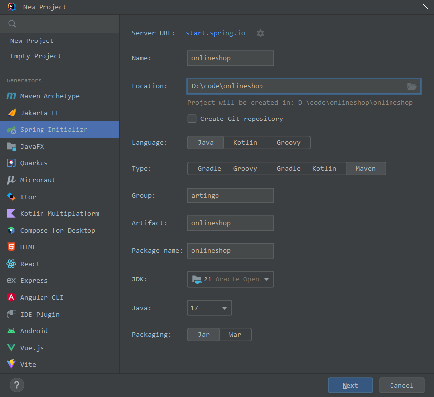
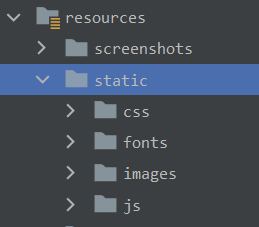
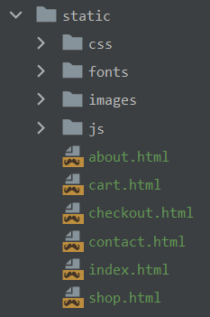
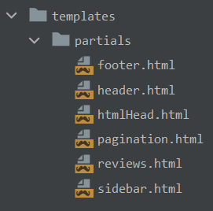
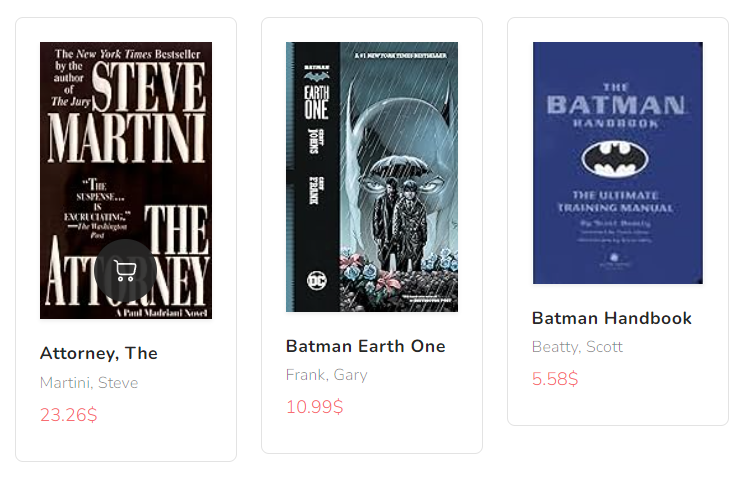
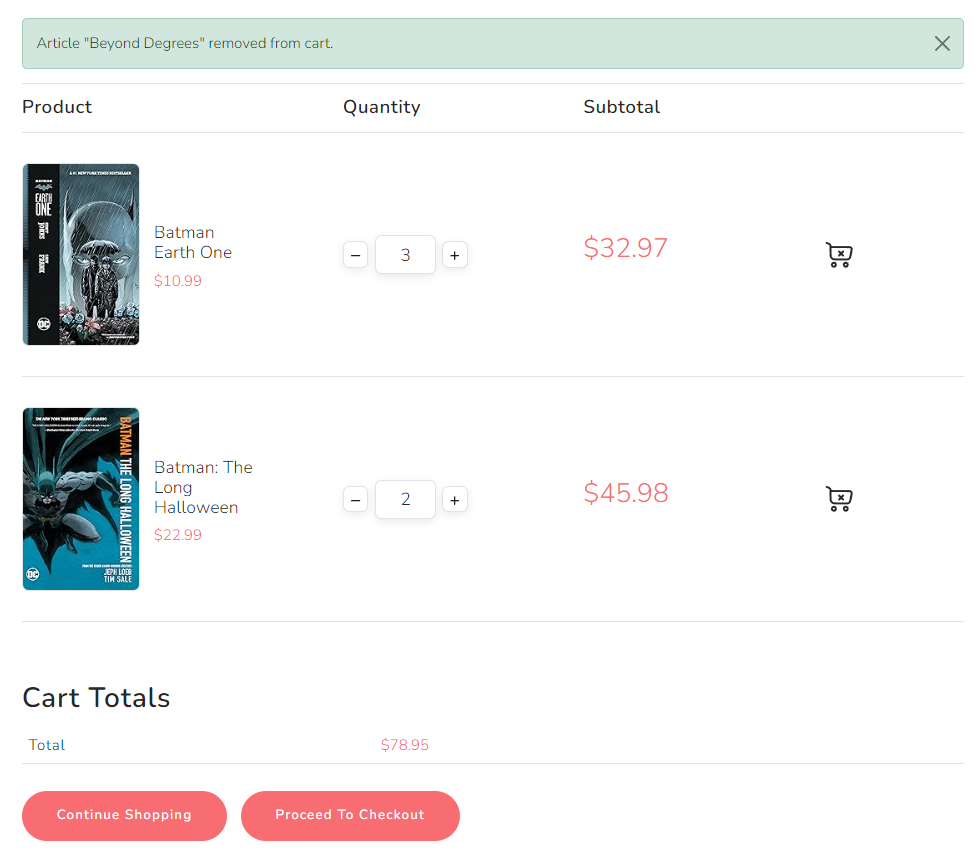

# Spring Boot course

This project is meant to teach Spring Boot fundamentals by creating a bookshop, step by step. <br/>
It uses the [Spring Boot](https://docs.spring.io/spring-boot/docs/current/reference/html/getting-started.html) framework, a [Bootstrap 5](https://getbootstrap.com) frontend and stores its data in [CSV](https://en.wikipedia.org/wiki/Comma-separated_values) files.

This is how the final shop looks like:

<br/>
<br/>

Follow these steps to implement the bookshop:
## 1. Create project
1. In your IDE, create a new Spring Initializr project:<br/>
   
  

1. Wait until all files and folders are created. After that, add these dependencies to your [pom.xml](pom.xml) file: 
   ```xml
   <dependencies>
      <dependency>
         <groupId>org.springframework.boot</groupId>
         <artifactId>spring-boot-starter-mustache</artifactId>
         <version>3.2.1</version>
      </dependency>
      <dependency>
         <groupId>org.springframework.boot</groupId>
         <artifactId>spring-boot-starter-web</artifactId>
         <version>3.2.1</version>
      </dependency>
      <dependency>
         <groupId>org.springframework.boot</groupId>
         <artifactId>spring-boot-devtools</artifactId>
         <version>3.2.1</version>
      </dependency>
   </dependencies>
   ```
   
2. In your [application.properties](src/main/resources/application.properties), add the app name and set the Mustache file suffix to `html`:
   ```properties
   spring.application.name=Book Shop
   spring.mustache.suffix=.html
   ```

## 2. Add static resources  
1. Under the [resources](src/main/resources) directory, create this folder structure for static web files:<br/>
   
  

1. Under the [static](src/main/resources/static) directory, add the HTML file templates. Add the other static files (CSS, scripts, fonts), as well.<br/>
     
  

1. In the [Shop](src/main/java/onlineshop/Shop.java) class, start the Spring Boot server.
   ```java
   @SpringBootApplication
   public class Shop {
      public static void main(String[] args) {
        SpringApplication.run(Shop.class, args);
      }
   }
   ```
   Open this URL in your Browser: http://localhost:8080 <br/>
   Your static [start page](http://localhost:8080/index.html) should appear.

## 3. Split the pages into partials
1. Under the [resources](src/main/resources) directory, create a [templates](src/main/resources/templates) folder.
2. Move the [index.html](src/main/resources/static/index.html) file from [static](src/main/resources/static) to the new [templates](src/main/resources/templates) folder.
3. Under templates, create a [partials](src/main/resources/templates/partials) folder. Your folder structure should look like this, now:

4. From the [index.html](src/main/resources/templates/index.html) file, cut out part of the HTML head section and paste it to a new [htmlHead.html](src/main/resources/templates/partials/htmlHead.html) file in partials:
   ```html
   <meta charset="utf-8">
   <meta http-equiv="X-UA-Compatible" content="IE=edge">
   <meta name="viewport" content="width=device-width, initial-scale=1.0">
   <link rel="icon" href="/images/favicon.ico" sizes="48x48">
   <link rel="stylesheet" type="text/css" href="/css/bootstrap.min.css">
   <link rel="stylesheet" type="text/css" href="/css/style.css">
   <link rel="stylesheet" type="text/css" href="/css/swiper-bundle.min.css"/>
   <link rel="preconnect" href="https://fonts.googleapis.com">
   <link rel="preconnect" href="https://fonts.gstatic.com" crossorigin>
   ```

5. In the [index](src/main/resources/templates/index.html) file, create a reference to the freshly create [htmlHead](src/main/resources/templates/partials/htmlHead.html) file.
   ```handlebars
   <!DOCTYPE html>
   <html lang="end">
   <head>
       <title>Overview</title>
       {{> partials/htmlHead }}
   </head>
   ```
6. Repeat these steps for [header](src/main/resources/templates/partials/header.html), [footer](src/main/resources/templates/partials/footer.html) and other page sections.

7. Your file structure should look like this, now:<br/>
   
8. Your HTML file should look like this:
   ```handlebars
   <!DOCTYPE html>
   <html lang="en">
   <head>
       <title>Overview</title>
       {{> partials/htmlHead }}
   </head>
   <body>
   {{> partials/header }}
   <section class="hero-section position-relative padding-small">
       ...
   </section>
   <div class="shopify-grid padding-small">
       ...
   </div>
   {{> partials/footer }}
   </body>
   </html>
   ```
9. Repeat these steps for all other HTML files: move them to the [templates](src/main/resources/templates) folder and replace their partials code by Mustache templates. No HTML files should remain in the [static](src/main/resources/static) folder.
  
## 4. Create a Controller
1. Create a Controller class named [ShopController.java](src/main/java/onlineshop/controllers/ShopController.java)
2. Give it a `@Controller` annotation.
3. Add a method to handle the root URL: "/"
4. Add a method to handle `.html` URLs. The result should look like this:
   ```java
   @Controller
   public class ShopController {
        @GetMapping(value = {"/"})
        public String root(Model model) {
            return "redirect:/index.html";
        }
   
        @GetMapping(value = {"/{name}.html"})
        public String htmlMapping(@PathVariable String name, HttpSession session) {
            return name;
        }
   }
   ```

## 5. Import and display articles
1. In the [resources](src/main/resources) directory, create a [CSV file](src/main/resources/books.csv) containing a list of articles or books. It could look like this:
   ```
   Title;Author;Genre;Pages;Publisher;Price;Image
   God Created the Integers;Hawking, Stephen;mathematics;197;Penguin;24,50;https://m.media-amazon.com/images/I/71HKbmRoVmL._AC_UY218_.jpg
   ```
2. In the  [Shop](src/main/java/onlineshop/Shop.java) class, create a `readArticles()` method that will read a CSV file and fill a [Book](src/main/java/onlineshop/merchandise/Book.java) list from it. Pass the `fileName` and `List` as parameters:
   ```java
   private static void readArticles(String fileName, List<Book> books) { ... }
   ```
   
3. Create a getter method so that we can access the article list from outside.
   ```java
   public static List<Book> getArticles() {
        return books;
   }
   ```
4. In [ShopController.homePage()](src/main/java/onlineshop/controllers/ShopController.java#L28), load the article list and pass it to the view model.
   ```java
   @GetMapping(value = {"/index.html"})
   public String homePage(Model model) {
        model.addAttribute("articles", Shop.getArticles());
        return "index";
   }
   ```
5. In the [index.html](src/main/resources/templates/index.html) template, iterate over the `articles`. Integrate the article fields in the proper HTML code section.
   ```handlebars
   <div class="row product-content product-store">
     {{#articles}}
         <div class="col-lg-3 col-md-4 mb-4">
             <div class="card position-relative p-4 border rounded-3">
                 
                 <h6 class="mt-4 mb-0 fw-bold"><a href="#">{{title}}</a></h6>
                 <div class="review-content d-flex">
                     <p class="my-2 me-2 fs-6 text-black-50">{{author}}</p>
                 </div>
                 <span class="price mb-2 text-primary">{{price}}$</span>
                 <div class="card-concern position-absolute start-0 end-0 d-flex gap-2">
                     <button type="button" href="#" class="btn btn-dark" data-bs-toggle="tooltip" 
                       data-bs-placement="top" data-bs-title="Tooltip on top">
                         <svg class="cart"><use xlink:href="#cart"></use></svg>
                     </button>
                 </div>
             </div>
         </div>
     {{/articles}}
   </div>
   ```
6. Check the result in your browser. The dynamic articles from the CSV file should appear on your homepage: http://localhost:8080. The result should look like this:<br/>
   

## 6. Implement the cart functionality
### Add a CartItem class
1. To be able to add multiple copies of an item to the shopping cart, we need to extend the article or book class. To do this, we create a new [CartItem](src/main/java/onlineshop/merchandise/CartItem.java) class in the [merchandise](src/main/java/onlineshop/merchandise) package, which inherits from Book. 
2. Add a `quantity` field and generate a getter and setter for it.
3. Create a `getTotalPrice()` method which calculates the total price, taking into account the quantity. The code should look like this:
   ```java
   public class CartItem extends Book {
    private int quantity = 0;

    public int getQuantity() { return quantity; }
    public void setQuantity(int quantity) { this.quantity = quantity; }

    public double getTotalPrice() { return quantity * price; }
   }
   ```
### Refactor the Cart class
1. As we have changed the cart items from [Article](src/main/java/onlineshop/merchandise/Article.java) to [CartItem](src/main/java/onlineshop/merchandise/CartItem.java), we must refactor and correct all corresponding code lines. 
2. We want to use the shopping cart in the web server session, so we have to use the proper Spring Annotations. The resulting code should look like this:
   ```java
   @Component
   @SessionScope
   public class Cart {
        private List<CartItem> items = new ArrayList<>();
   
        public List<CartItem> getItems() { return items; }
   }
   ```
3. Create a method that finds a cart item by its article number:
   ```java
   private CartItem findItem(int articleNo) { ... }
   ```
4. Create a method to add an article to the shopping cart. If the article already exists, its quantity should be increased.
   ```java
   public void addArticle(Book book) { ... }
   ```
5. Create a method to remove an article from the shopping cart.
   ```java
   public boolean removeArticle(int articleNo) { ... }
   ```
6. Create a method to decrease the quantity of an existing article.
   ```java
   public boolean decreaseQuantity(int articleNo) { ... }
   ```

### Modify the ShopController
1. To use the Shop sortiment and Cart items, add those Beans to the [ShopController](src/main/java/onlineshop/controllers/ShopController.java) using the `@Autowired` annotation:
   ```java
   @Controller
   public class ShopController {
      @Autowired
      Shop shop;
   
      @Autowired
      Cart cart;
   }
   ```
2. In the [ShopController](src/main/java/onlineshop/controllers/ShopController.java), create a method `getCartItems()` that adds the current cart items to the model.
   ```java
   private void getCartItems(Model model) { ... }
   ```
3. Call the `getCartItems()` method at the end of the `homePage()` and `htmlMapping()` methods.   
4. As this is the second controller and there are more to come, we should move the controllers to their own package. To do so, create a new [controllers](src/main/java/onlineshop/controllers) package under the [onlineshop](src/main/java/onlineshop) folder. Move the [ShopController](src/main/java/onlineshop/ShopController.java) to that package. 

### Create a CartController
1. We need a new Controller to handle cart actions. In the [controllers](src/main/java/onlineshop/controllers) package, create a new [CartController](src/main/java/onlineshop/controllers/CartController.java). It should handle every request starting with `/cart`.
   ```java
   @Controller
   @RequestMapping(value = "/cart")
   public class CartController { ... }
   ```

2. We need methods to add and remove cart items, as well as to increase and decrease their quantity. First, create the `addToCart()` method.
   ```java
   @GetMapping(value = {"/add/{articleNo}"})
   public String addToCart(
        @PathVariable(name = "articleNo") Integer articleNo, 
        RedirectAttributes atts) { ... }
   ```
3. Next, implement the `removeFromCart()` method.
   ```java
   @GetMapping(value = {"/remove/{articleNo}"})
    public String removeFromCart(
        @PathVariable(name = "articleNo") Integer articleNo, 
        RedirectAttributes atts)  { ... }
   ```
4. Don't forget to add the `increaseQuantity()` and `decreaseQuantity()` methods.
   ```java
   @GetMapping(value = {"/increase/{articleNo}"})
   public String increaseQuantity(
        @PathVariable(name = "articleNo") Integer articleNo) { ... }
   
   @GetMapping(value = {"/decrease/{articleNo}"})
    public String decreaseQuantity
        (@PathVariable(name = "articleNo") Integer articleNo, 
        RedirectAttributes atts) { ... }
   ```
5. After most of the actions, we want to give feedback to the user, so we will be using the [FlashAttribute](https://docs.spring.io/spring-framework/docs/current/javadoc-api/org/springframework/web/servlet/mvc/support/RedirectAttributes.html#addFlashAttribute(java.lang.Object)) in [RedirectAttributes](https://docs.spring.io/spring-framework/docs/current/javadoc-api/org/springframework/web/servlet/mvc/support/RedirectAttributes.html).
   ```java
   public String addToCart(..., RedirectAttributes atts) {
        ...
        atts.addFlashAttribute(MESSAGE, message);
        atts.addFlashAttribute(SHOW_MESSAGE, true);
   }
   ```
6. We will use the `showMessage` flag to make the `message` visible in the HTML pages.
   ```handlebars
   {{#showMessage}}
   <div class="alert alert-success alert-dismissible fade show" role="alert">
      {{message}}
      <button type="button" class="btn-close" data-bs-dismiss="alert"></button>
   </div>
   {{/showMessage}}
   ```
   
### Connect the homepage to the CartController
1. Next, we want to trigger the controller's actions from the HTML pages. To do so, edit the [index.html](src/main/resources/templates/index.html) file, find the cart button and insert the proper `href`.
   ```html
   <a href="/cart/add/{{articleNo}}" role="button" class="btn btn-dark"
   data-bs-toggle="tooltip" data-bs-placement="top">
    <svg class="cart"><use xlink:href="#cart"></use></svg>
   </a>
   ```
2. In the [header.html](src/main/resources/templates/partials/header.html), find the cart section and show the number of cart items.
   ```handlebars
   <span class="fs-6 fw-light">{{numOfCartItems}}</span>
   ```
3. Furthermore, list the cart items. If the quantity is > 1, then it is shown, separately, with the help of the `showQuantity` getter.
   ```handlebars
   {{#cartItems}}
   <li class="list-group-item bg-transparent d-flex justify-content-between lh-sm">
      <div>
        <h5><a href="details.html?id={{articleNo}}">
                  {{#showQuantity}} {{quantity}} × {{/showQuantity}}
                  {{title}}
              </a>
        </h5>
        <small>{{author}}</small>
      </div>
      <span class="text-primary">${{totalPrice}}</span>
   </li>
   {{/cartItems}}
   ```

### Implement the cart page
1. Finally, we implement the cart page. To do so, we first want to display any messages from the server.
   ```handlebars
   {{#showMessage}}
     <div class="..." role="alert">
         {{message}}
         <button type="button" class="btn-close"></button>
     </div>
   {{/showMessage}}
   ```
2. Then, we iterate over the cartItems and display them.
   ```html
   {{#cartItems}}
   <div class="cart-item border-bottom padding-small">
      <div class="row align-items-center">
         <div class="col-lg-4 col-md-3">...</div>
         <div class="col-lg-6 col-md-7">...</div>
         <div class="col-lg-1 col-md-2">...</div>
     </div>
   </div>
   {{/cartItems}}
   ```
   
3. In the first column, we display the article image, title and price. 
   ```handlebars
   <div class="cart-info d-flex gap-2 flex-wrap align-items-center">
     ...
     
     ...
     <h5 class="mt-2"><a href="/details/{{articleNo}}">{{title}}</a></h5>
     ...	
     <span class="price text-primary fw-light" data-currency-usd="${{price}}">${{price}}</span>
   </div>
   ```
4. In the second column, we place a quantity input field, as well as plus and minus buttons. We add hyperlinks to trigger the corresponding actions.
   ```handlebars
   <a href="/cart/decrease/{{articleNo}}">
       <button type="button" class="...">
           <svg><use xlink:href="#minus"></use></svg>
       </button>
   </a>
   <input type="text" id="quantity" class="..." value="{{quantity}}" min="1" max="100" required>
   <a href="/cart/increase/{{articleNo}}">
       <button type="button" class="...">
           <svg><use xlink:href="#plus"></use></svg>
       </button>
   </a>
   ```
5. Finally, in the third column, place a remove icon. Add a hyperlink to remove this article from the cart, regardless of the quantity.
   ```handlebars
   <a href="/cart/remove/{{articleNo}}">
     <svg class="cart-cross-outline">
         <use xlink:href="#cart-cross-outline"></use>
     </svg>
   </a>
   ```
6. Don't forget to show the grand total in the `Cart Totals` section.
   ```handlebars
   <td data-title="Total">
      <span class="...">
        <bdi>
          <span class="price-currency-symbol">$</span>{{grandTotal}}
        </bdi>
      </span>
   </td>

   ```
7. The card page should be fully functional, now, and look similar to this:<br/>
   